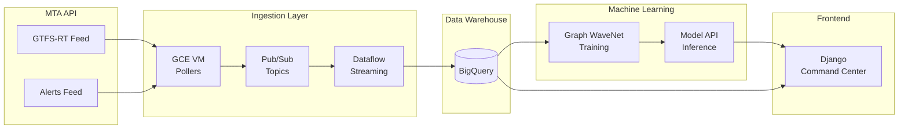

# NYC Subway Headway Prediction with Graph WaveNet

A deep learning system for predicting train headways on the NYC Subway A, C, E lines using spatial-temporal graph neural networks.

## Table of Contents

- [Project Overview](#project-overview)
  - [Phase 1: Define the Prediction Task](#phase-1-define-the-prediction-task)
  - [Phase 2: Create a Data Representation](#phase-2-create-a-data-representation)
  - [Phase 3: Build Graph WaveNet Architecture](#phase-3-build-graph-wavenet-architecture)
  - [Phase 4: Deploy to Production](#phase-4-deploy-to-production)
  - [Phase 5: Command Center UI](#phase-5-command-center-ui)
- [Architecture](#architecture)
- [Project Structure](#project-structure)
- [Data Schema](#data-schema)
- [License](#license)

---

## Project Overview

This project builds an end-to-end machine learning system for real-time subway headway prediction, from data ingestion through model deployment and monitoring.

### Phase 1: Define the Prediction Task

**Goal:** Predict headways (time between consecutive trains) for the complete A, C, E subway line to enhance operational performance.

Headway prediction enables:
- Proactive service adjustments before delays cascade
- Better passenger information and travel planning
- Identification of systemic patterns in service reliability

### Phase 2: Create a Data Representation

**Goal:** Build a streaming ingestion pipeline to capture GTFS real-time subway data and service alerts.

The pipeline captures:
- **Vehicle positions** - Real-time train locations, updated every 30 seconds
- **Service alerts** - Delays, planned work, and service changes affecting A/C/E lines

Data flows from MTA feeds → Pub/Sub → Dataflow → BigQuery for training dataset construction.

### Phase 3: Build Graph WaveNet Architecture

**Goal:** Train a deep learning model using Graph WaveNet to predict headways.

The model leverages:
- **Spatial dependencies** - Stations connected along the A/C/E network (graph structure)
- **Temporal patterns** - Historical headway sequences with dilated causal convolutions
- **Adaptive adjacency** - Learned relationships beyond physical track connections

### Phase 4: Deploy to Production

**Goal:** Deploy the trained model to make predictions on the real-time event feed.

The inference pipeline:
- Consumes live vehicle position data from Pub/Sub
- Generates headway predictions for upcoming arrivals
- Serves predictions via API for downstream applications

### Phase 5: Command Center UI

**Goal:** Monitor real-time headways through a Django web application.

The command center provides:
- Live headway visualization across all A/C/E stations
- Predicted vs. actual headway comparisons
- Alert correlation and disruption impact analysis

---

## Architecture



📘 **[Ingestion Operations Guide](docs/operations_guide.md)** - Deployment commands, workflows, and troubleshooting

---

## Project Structure

```
graph_wavenet/
├── Makefile                    # Deployment automation
├── README.md
├── .gitignore
│
├── infrastructure/
│   └── terraform/              # GCP infrastructure as code
│       ├── main.tf             # Provider, APIs, service accounts
│       ├── variables.tf        # Configuration variables
│       ├── outputs.tf          # Resource outputs
│       ├── pubsub.tf           # Topics and subscriptions
│       ├── bigquery.tf         # Dataset and tables
│       ├── compute.tf          # Poller VM
│       └── dataflow.tf         # Template storage
│
├── ingestion/
│   ├── poller/                 # GTFS-RT polling service
│   │   ├── config.py           # Configuration from environment
│   │   ├── gtfs_poller.py      # Vehicle positions (protobuf → JSON)
│   │   ├── alerts_poller.py    # Service alerts (JSON)
│   │   ├── main.py             # Concurrent polling entrypoint
│   │   └── requirements.txt
│   │
│   └── dataflow/               # Stream processing
│       ├── pipeline.py         # Apache Beam pipeline
│       ├── transforms/
│       │   ├── parse_gtfs.py   # Extract vehicle positions
│       │   └── parse_alerts.py # Extract A/C/E alerts
│       └── schemas/
│           └── __init__.py     # BigQuery schemas
│
├── model/                      # Graph WaveNet implementation
│   ├── graph_wavenet.py        # Model architecture
│   ├── train.py                # Training script
│   ├── data/
│   │   └── loader.py           # BigQuery data loading
│   └── layers/
│       ├── adaptive_adjacency.py
│       ├── graph_conv.py
│       └── temporal_conv.py
│
└── docs/
    └── implementation_plan.md
```

---

## Data Schema

### Vehicle Positions Table

Captures real-time train locations, polled every 30 seconds.

| Field | Type | Description |
|-------|------|-------------|
| `entity_id` | STRING | Unique entity ID from feed |
| `trip_id` | STRING | GTFS trip identifier |
| `route_id` | STRING | Route (A, C, E, H) |
| `direction` | STRING | N (northbound) or S (southbound) |
| `path_id` | STRING | Path identifier (e.g., 55R) |
| `stop_id` | STRING | Current station |
| `current_status` | STRING | STOPPED_AT, INCOMING_AT, IN_TRANSIT_TO |
| `vehicle_timestamp` | TIMESTAMP | When train reported position |
| `feed_timestamp` | TIMESTAMP | When MTA generated feed |
| `ingest_time` | TIMESTAMP | When we received it |

### Service Alerts Table

Captures delays, planned work, and service changes.

| Field | Type | Description |
|-------|------|-------------|
| `alert_id` | STRING | Unique alert identifier |
| `alert_type` | STRING | Category (Delays, Planned - Stops Skipped, etc.) |
| `affected_routes` | STRING[] | Routes affected (filtered to A/C/E) |
| `affected_stops` | STRING[] | Stops mentioned |
| `active_period_start` | TIMESTAMP | When alert becomes active |
| `active_period_end` | TIMESTAMP | When alert expires |
| `header_text` | STRING | Short description |
| `description_text` | STRING | Detailed description |

---

## License

MIT
